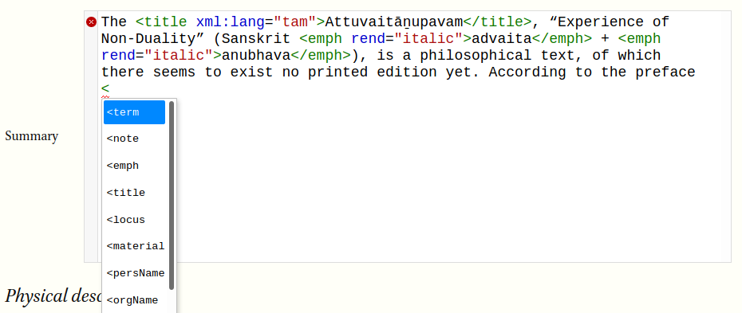

# TST editor

This repository contains an editing interface for the TST project. It has been tested on the latest versions of __Firefox__, __Chrome__, and __Edge__ (Safari is currently not supported). To use the editor, go to https://tst-project.github.io/editor/

## How to create a manuscript record

When you open the editor, you will be asked to either start a new file or select an existing file from your computer. If there are any autosaved files, they will also appear there.

### A basic record

The editor presents a rich interface that can be used to create very detailed records. But, at a minimum, your record should contain:

* a shelfmark
* a manuscript title (which can be the title of the text, or a descriptive title, such as "fragment of the Kantapurāṇam")
* your name
* your institutional affiliation
* a summary description of the manuscript
* a physical description (material, extent, leaf size)
* the title of the text(s) contained in the manuscript
* the transcription conventions and abbreviations used in the record

Those fields, in the editor, are marked with a dashed red line if they are empty, to indicate that they are required. When you have filled them out, click **preview** to see your record formatted. When you are satisfied, click **save as...** to save the XML file to your computer, and submit it to the TST project.

## XML tagging

The records are stored in TEI XML format. Some fields in the editor allow for XML tags; they will have a **grey margin on the left-hand side**. When you click **preview**, the editor will check your record for XML errors, which you will need to fix before continuing.

### If you don't want to bother with XML...

If you don't understand tagging or don't want to bother with it, don't worry! Just type in plain text. However, certain characters, such as **<**, **>**, and **&**, are not allowed in those fields. If you use them in XML fields, they will be in bright red or underlined in red. If you wish to use those characters, type this instead:

* **&amp;lt;** instead of **<**
* **&amp;gt;** instead of **>**
* **&amp;amp;** instead of **&**

### If you want to use XML tags

In an XML-enabled field, when you type **<**, a drop-down menu will appear with a list of common tags that you can use. The most common of these are:

* `<emph rend="bold"></emph>` for **bold** text
* `<emph rend="italic"></emph>` for **italic** text
* `<title xml:lang="tam"></title>` for titles; they are rendered in italic when transliterated. You may use the `xml:lang` attribute to specify the language of the title, but that is not required.
* `<locus>folio XX</locus>` for specifying a locus. In addition, you can use the `facs` attribute to denote the image number of the digital reproduction; e.g., `facs="1"` would link it to the first image, `facs="2"` would link it to the second image, etc.
* `<milestone n="X" unit="folio"/>` can be used in a transcription to indicate where the transcription starts from. Again, the `facs` attribute can be used to link it to an image.

If there are any XML errors, they will be underlined in red. There may also be a red circle with an X in the left margin. Hover over that circle to see a description of the error.

## Foliation (Codicological units)

In the foliation section, you may define a number of codicological units, which you can refer to later. For example, in a multi-text manuscript, you might have a unit titled "mūlam" and one titled "urai". You may also describe unfoliated units, such as a title folio or guard folios.

Give each unit a unique name, without spaces. They can be descriptive, such as "text" and "guard-folios", or enumerated, such as "U1", "U2", etc.

In the "Scribal hand" and "Contents" sections, you can then refer back to those units that you defined previously.

## Transcription

In the transcription fields, such as "Incipit", "Explicit", and "Colophon", it may be useful to use these XML tags:

* `<lb/>` indicates a line break. `<pb/>` indicates a page break.
* `<add place=""></add>` indicates text that has been inserted. Use the `place` attribute to indicate where the insertion is written, e.g., "left-margin", "above", "inline".
* `<del rend=""></del>` indicates text that has been deleted. Use the `rend` attribute to indicate how the deletion has been made, e.g., "crossed out", "two dots above", "line below".
* `<unclear reason=""></unclear>` indicates text that is unclear. Use the `reason` attribute to explain why, e.g., "illegible", "smeared", "uninked".
* `<damage unit="akṣara" quantity="" agent=""></damage>` indicates text that has been damaged. Use the `quantity` attribute to indicate the number of akṣaras that are damaged. Use the `agent` attribute to indicate the kind of damage, e.g., "worms", "rubbing", etc.
* `<supplied></supplied>` indicates text that you have supplied. Use it, for example, inside the `<damage>` tag to supply an emendation.
* `<gap unit="akṣara" quantity="" reason=""/>` indicates a gap in the transcription. Use the `quantity` attribute to indicate the number of akṣaras not transcribed, and use the `reason` attribute to explain why, e.g., "illegible", "damaged", etc.
